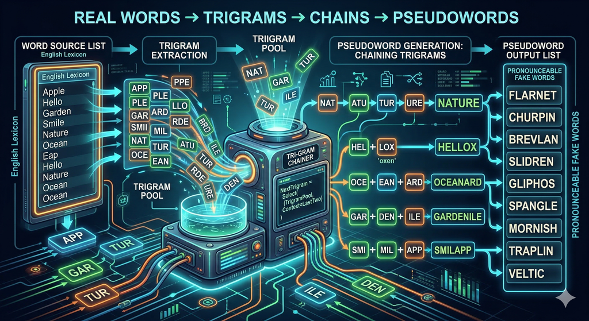

# Unipseudo-go Pseudoword Generator

* [HTML version](https://chrplr.github.io/unipseudo-go) of this document
* [Github repository](https://github.com/chrplr/unipseudo-go) of the project

This program generates pseudowords (pronounceable, fake words that look like real words) by chaining trigrams (sequences of three characters) extracted from a provided list of real words using Markov chains. 




The generated pseudowords are guaranteed to:
- Be of a specific, targeted length.
- Not exactly match any of the original words used to build the model.
- Be structurally similar to the words in the provided dictionary.

For more info, see:

> New, B., Bourgin, J., Barra, J., & Pallier, C. (2024). UniPseudo: A universal pseudoword generator. Quarterly Journal of Experimental Psychology, 77(2), 278–286. https://doi.org/10.1177/17470218231164373 [[PDF](https://www.pallier.org/papers/Unipseudo.pdf)]


## Origin

This Go program is a direct port of the original R script, [pseudoword-generation-by-markov-on-trigrams.R](https://github.com/chrplr/openlexicon/blob/master/scripts/pseudoword-generation-by-markov-on-trigrams/pseudoword-generation-by-markov-on-trigrams.R).

This script runs the [Unipseudo](http://www.lexique.org/shiny/unipseudo/) web tool.

The Go port maintains the exact structural and algorithmic behavior of the R script—such as position-dependent trigram selection and robust UTF-8 handling—while optimizing the generation process using pre-indexed trigram maps for O(1) transitions. 

## Installation

You have two options for installing and running the pseudoword generator: downloading a pre-compiled binary (no dependencies required) or building from source.

### Option 1: Download Pre-compiled Binaries (Recommended)

You do **not** need to install Go to run this program. Pre-compiled binaries are available for Linux, Windows, and macOS (both Intel and Apple Silicon/ARM).

1. Go to the [Releases page](../../releases) of this repository.
2. Download the binary that matches your operating system and architecture.
3. Extract the downloaded archive.
4. Give the binaries execution rithg and run it from your terminal or command prompt:
   ```bash
    chmod +x pseudoword-generator
   ./pseudoword-generator [options]
   ```
   *(On Windows, use `pseudoword-generator.exe`)*

### Option 2: Build from Source

If you prefer to compile the program yourself, you will need to install Go.

1. Download and install Go from the [official Go website](https://go.dev/doc/install).
2. Clone this repository to your local machine.
3. You can either compile the binary using the provided script:
   ```bash
   ./build.sh
   ./pseudoword-generator [options]
   ```
   Or run the code directly without compiling an explicit executable:
   ```bash
   go run pseudoword_generator.go [options]
   ```

## Usage

### Command-line Options

The program accepts the following flags:

- `-n <int>` : Number of pseudowords to generate (default: `10`)
- `-l <int>` : Exact length of the generated pseudowords (default: `7`)
- `-m <int>` : Minimum length of model words to read from the dictionary (default: `5`)
- `-f <string>`: Path to the input word list file (default: `liste.de.mots.francais.frgut.txt`)

### Examples

Generate 5 pseudowords of length 8 using the default French dictionary:

```bash
go run pseudoword_generator.go -n 5 -l 8
```

*Sample Output:*
```text
murfaten
réseste
délaine
fillonti
cleulât
```

Generate 20 short pseudowords (length 6):

```bash
go run pseudoword_generator.go -n 20 -l 6
```

## How it Works

1. **Data Loading**: The program reads a list of words from the specified text file (one word per line). It filters out words that are too short based on the minimum length (`-m`) flag.
2. **Model Building**: Words are padded with spaces to denote word boundaries. The program extracts trigrams and catalogs them based on their exact starting position in the word. 
3. **Generation**: 
   - It picks a random initial trigram (starting at position 0).
   - It builds the rest of the word letter by letter. For each step, it looks at the last two letters (the "bigram") and randomly selects a compatible third letter from the pool of trigrams found at that specific position in the model words.
   - If it hits a dead end (no valid trigram continues the sequence), it throws away the current attempt and restarts.
4. **Filtering**: It ensures the newly generated string hasn't been generated already during this run and does not exist in the original model dataset.

## Word lists

* `liste.de.mots.francais.frgut.txt`  comes from <https://github.com/chrplr/openlexicon/blob/master/datasets-info/Liste-de-mots-francais-Gutenberg/README-liste-francais-Gutenberg.md>
* `english.word.list.subtlexus4.txt` comes from <https://www.ugent.be/pp/experimentele-psychologie/en/research/documents/subtlexus>

## License

This project is distributed under the terms of the GNU General Public License v3.

Copyright (c) 2026 Christophe Pallier
